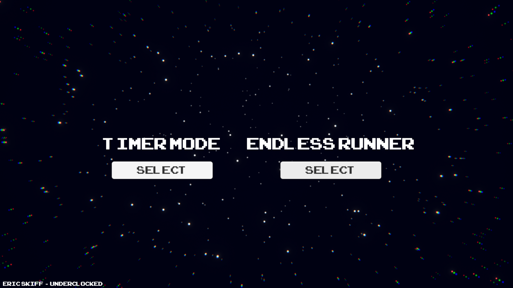
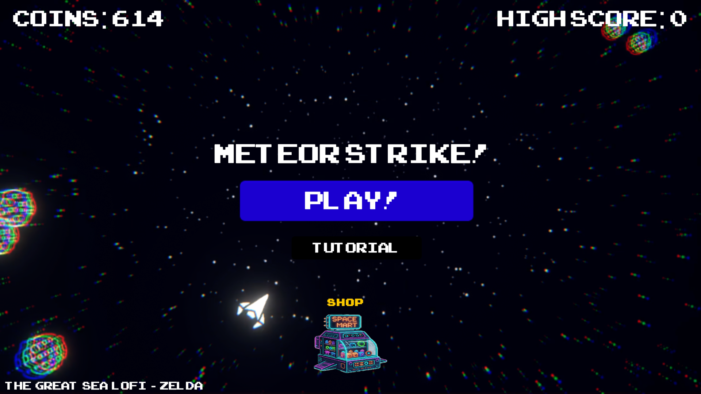
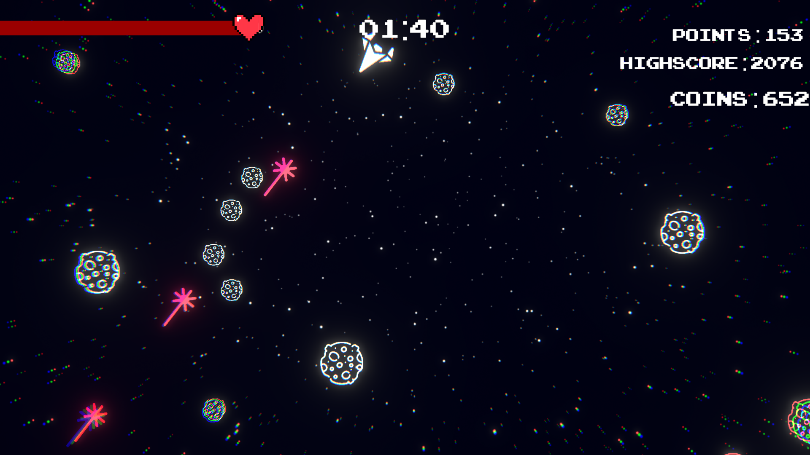
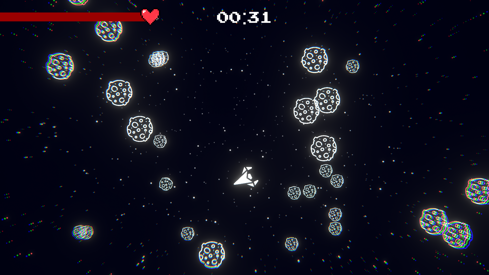

# ☄️ Meteor Strike

A fast-paced **2D PC arcade shooter** where survival is the only objective — and chaos escalates fast.

In **Meteor Strike**, you pilot a spaceship through relentless waves of asteroids while trying to survive a **10-minute challenge mode**. Every **2 minutes**, the difficulty ramps up: asteroids spawn faster, collisions become more dangerous, and the screen fills with debris.

Reflexes matter — but **smart upgrades matter even more**.

🎮 **Play the game:**
https://apexinteractive.itch.io/meteorstrike

---

## 📷 Screenshots

  
  

  
  

---

# 🚀 Gameplay Overview

Your objective is simple:

**Survive the full 10 minutes.**

But the longer you survive, the more intense the battlefield becomes.

Every **2 minutes**:

* Asteroid spawn rate increases
* Space becomes more crowded
* Dodging and positioning become harder

Asteroids can **fragment on collision**, filling the screen with smaller debris and turning the battlefield into pure arcade chaos.

---

# ⚡ Power-Up Driven Action

Destroy asteroids to collect **coins** and fill your **upgrade bar**.

When the bar fills, you can choose **one of nine temporary power-ups** that dramatically change how you play.

Each selected power-up stays active **until the next upgrade**, meaning every run becomes a **dynamic strategy decision**.

Active power-ups appear as **icons at the bottom of the screen**, allowing players to quickly see their current advantage.

---

# 🌟 Power-Ups

Some of the available upgrades include:

### ⚡ Sweet Trio

Boosts your firepower with additional projectiles.

### ⚡ Thunderstruck

Unleash devastating lightning-based attacks.

### ⚡ Golden Gravity

Pull nearby coins and resources toward your ship.

### ⚡ Fortune Symphony

Increase rewards and resource collection.

### ⚡ Clockwork Heart

Enhance survivability and durability.

### ⏱ Time Frame

Freezes all asteroids for **15 seconds**, giving players a brief moment of control.

### ✨ Aether Veil

Provides temporary defensive benefits.

…and more combinations to experiment with.

---

# ☄️ Arcade Chaos

Meteor Strike is designed to create **increasing on-screen chaos**.

As asteroids break apart and spawn faster:

* The screen fills with debris
* Coins scatter everywhere
* The player must balance **dodging, collecting, and upgrading**

The longer you survive, the more the battlefield turns into a **bullet-hell survival arena**.

---

# 🎯 Features

* Fast, responsive **2D arcade shooter gameplay**
* **10-minute survival mode** with escalating difficulty
* **9 unique temporary power-ups**
* Dynamic **upgrade system**
* Designed for **short, replayable mobile sessions**
* Increasing chaos as the timer progresses

---

# 🛠 Tech Stack

* Unity / C#

---

# 📌 Development Notes

Meteor Strike was designed to deliver **quick, intense arcade sessions** where every run feels different.

By combining:

* escalating difficulty
* strategic upgrades
* fast reflex gameplay

the game creates a **constantly evolving survival experience**.

---

# 🧠 The Challenge

Can you survive the **full 10 minutes**?

Or will the meteor storm claim your ship?

---

# ⭐ If you enjoyed the project

Consider **starring the repository** or trying the game!
